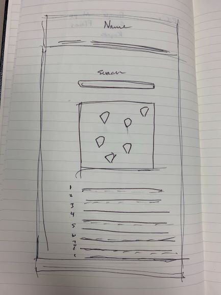
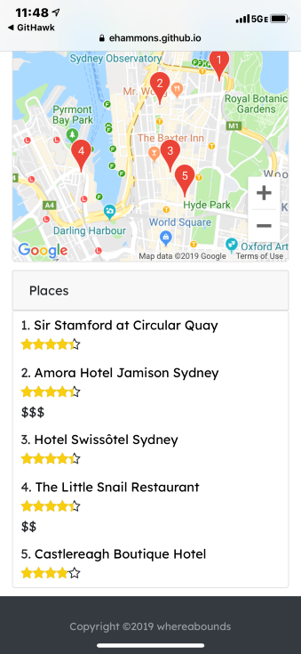

# whereabounds app
Deployed at: https://ehammons.github.io/whereabounds/

## Group members:
* Elise Hammons: https://github.com/EHammons
* Kristen Stroup: https://github.com/Knwhit20
* Aaron Phillips: https://github.com/aaronphillips929
* Christopher Mlinac: https://github.com/cmlinac
> Web app for displaying user-submitted city details including weather, maps, places and more.

## Table of contents
* [Group Members](#group-members)
* [General info](#general-info)
* [Tasks](#original-task-breakdown)
* [Screenshots](#screenshots)
* [Technologies](#technologies)
* [Setup](#setup)
* [Features](#features)
* [Status](#status)
* [Inspiration](#inspiration)
* [Contact](#contact)

## General info
Created for a coding class project, all group members have collaborated to create a working, useful all-in-one app to give a user information about their selected city.

## Original Task Breakdown
* Elise: Write jQuery to display API Data
* Kristen: Implement Weather API
* Aaron: Implement Google APIs
* Christopher: Make basic HTML Wireframe

## Screenshots

## Technologies
* Weatherbit API - v2.0
* Google Places API
* Google Maps API
* jQuery
* JavaScript
* HTML5
* CSS3
* Bootstrap

## Setup
Slide presentation: https://docs.google.com/presentation/d/1YK1e6_B67bf-K0BaA4KKIPfMjGx60u9iZOIXU8m0-Vg/edit?usp=sharing

## Code Examples
Show examples of usage:

    if (results[i].rating !== undefined) {
        var placeRatings = results[i].rating;
        var starTotal = 5;
        var starPercentage = (placeRatings/starTotal) * 100;
        var starPercentageRounded = (Math.round(starPercentage));
        var stars = $("
");
        stars.addClass("stars-outer");
        var place = $("
");
        place.addClass("stars-inner");
        $(stars).append(place);
        $(place).width(starPercentageRounded+"%");
        ratingDiv.append(stars);
    }

    function geocodeLatLng(address) {
    geocoder.geocode({'address': address}, function(results, status) {
    if (status === 'OK') {
        if (results[0]) {
            var lat = results[0].geometry.location.lat();
            var lng = results[0].geometry.location.lng();
            displayCity(lat, lng);
            var latlng = lat + "," + lng
            // here is where we can call other functions, it's the 'good' path
            findPlaces(latlng);
            return latlng;
        } else {
            console.log('No results found');
        }
        } else {
            console.log('Geocoder failed due to: ' + status);
        }
        });
    }

## Features
List of features ready and TODOs for future development
* User input city results in:
* Five day weather forecast
* Five places to visit

## Status
Project is: _finished_ and submitted for Project 1.

## Inspiration
Project created for The Coding Bootcamp at UT Austin.

## Contact
Created by [Group Members](#group-members)
